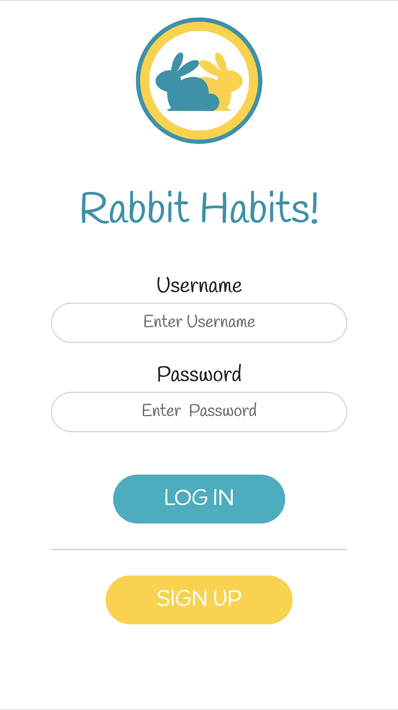
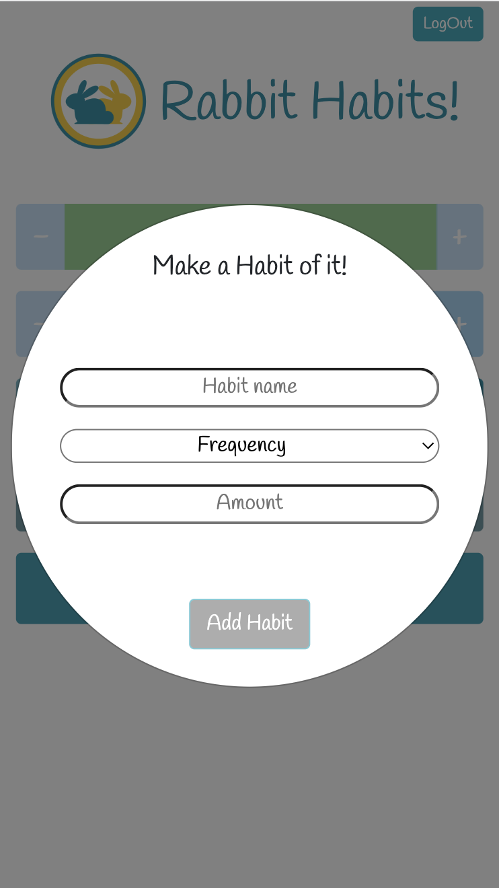
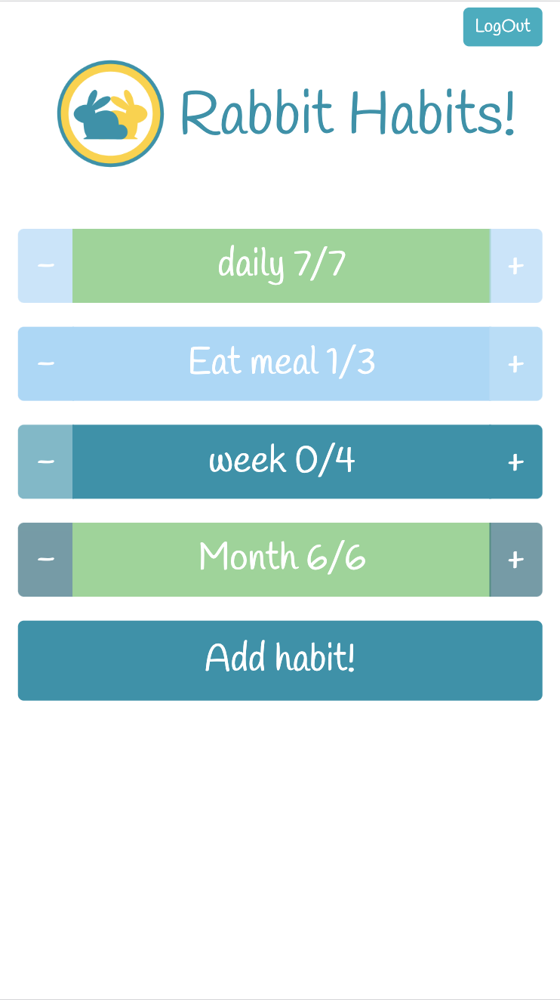
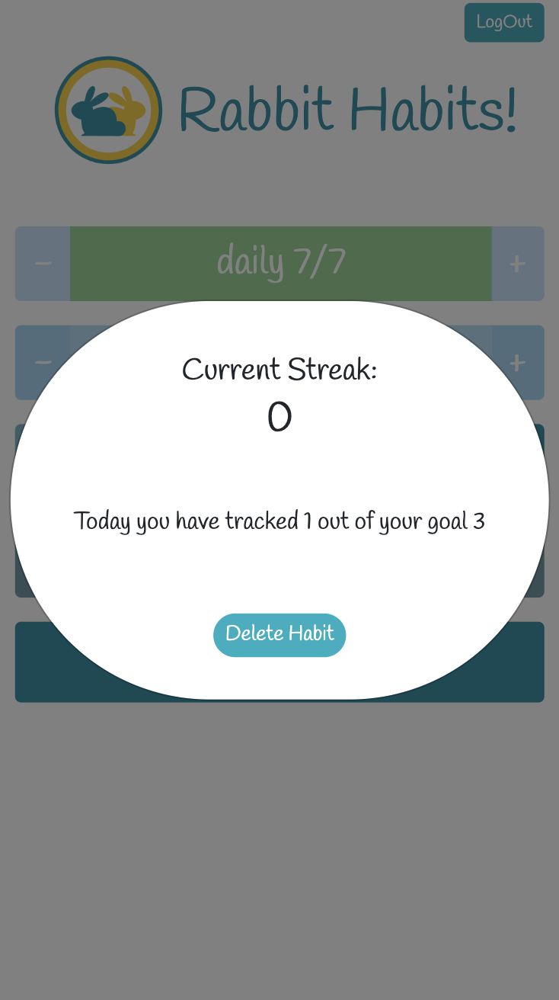

# Lap2_project_client

# Rabbit Habits

Let the rabbits take care of your habits!

Register to our new service and start tracking your habits today!

---

## Usage

Go to our webpage https://rabbit-habits.netlify.app and register a new account with a secure password. 

You will need to register with a unique username. Don't worry! Our page will notify you if the username you have chosen is already being used!

After receiving the notification that your account has been registered you will need to re-insert the password to login.

---

You're all set to start! Start by adding your first habit! Your habits can be tracked on a daily, weekly or monthly basis.
Note: Your habit will need to be between 3 and 20 characters long.

Now that you have added your habits you can track them! Use the plus and minus buttons to track your activities individually! The activities are coloured and ordered based on frequency, starting with daily habits and ending with monthly habits. The habits completed for the current time frame will change colour to green and will not be able to be modified until the next reset.

You can track your streak of completion by clicking on the activity button. The streak will be tracked automatically by the server on user login.

---

### Technologies

- HTML/CSS
- JavaScript (JS)
- BootStrap
- Jest

---

### Process

- Started by creating sample HTML files where different design ideas were created
- Once the best design was determined, the main page was made to be rendered in JS
- Implemented fetch functions to communicate with the server and retrieve data
- Structured the data injection into the HTML
- Handled the login and data retrieval based on user
- Handled localStorage for user login and logout

---

# Challenges and future improvements

## Wins and Challenges
- Loading spinner while page is rendering
- Rendering of the page
- Dynamic text changes on button input to show completion of goal
- Button deactivation handling 

## Future improvements
- Rendering of the login page
- Delete user profile
- Add 'Hi (user)' when user logs in
- Get user email in order to recover password

---

### Licence

[MIT licence](https://github.com/Naereen/StrapDown.js/blob/master/LICENSE)

# Creators

[Aaron](https://github.com/Aaron-Marsh) [Billie](https://github.com/dartbill) [Gio](https://github.com/Gioele-M) [Tom](https://github.com/tomhughes87)

